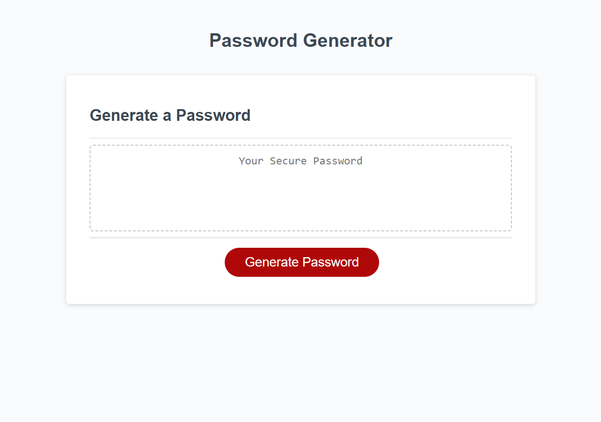

# Password Generator

>## Description

 This webpage generates a random password by listening for user click on the "Generate Password" button.

 First it prompts user to select a number between 8 and 128. It will exit out of function if user selects number outside of set parameters.
 If user selection is within parameters, it will allow user to choose whether to add lowercase letters, uppercase letters, numbers, and/or 
 special characters. 

 It will then create a random password based on the user's selections and display it within the generate password field.

>## Code Style & Tech/Framework Used

  For this project, I've utilized Visual Studio Code in order to edit the webpage's javascript and implement these changes.

>## Demo

The following image shows the web application's appearance and functionality:

>## Features

* Implemented Javascript knowledge of variables, for loops, if statements, functions and event listeners.

* Generate Password button 'listens' for user click in order to set off function's chain of commands.

* Function creates a concatenated array including all the special characters available and then generates a randomized password at the user specified length.

